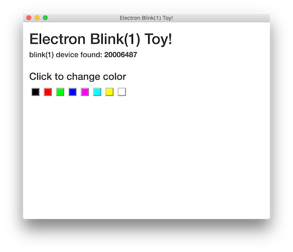

# electron-hid-toy

A simple Electron app to experiment with `node-hid`.



Tested on Electron v5.0.1. Originally tested on Electron v1.2.6.

To use:
```
npm install
npm start
```

To build the application:
```
npm install
npm build
```

Notes:
On latest MacOS, you will need to sign the `node-hid` shared library with your developer credentials and copy it into the app:

```
npm install -g electron-osx-sign
cp node_modules/node-hid/build/Release/HID.node dist/mac/
electron-hid-toy.app/Contents/MacOS
electron-osx-sign dist/mac/electron-hid-toy.app  dist/mac/electron-hid-toy.app/Contents/MacOS/HID.node
```

- Uses the magic of `require('babel-register')` in both the app and renderer to do on-the-fly transpiling

- This project leans heavily on https://github.com/b52/electron-es6-react
and http://electron.rocks/electron-builder-explained/
